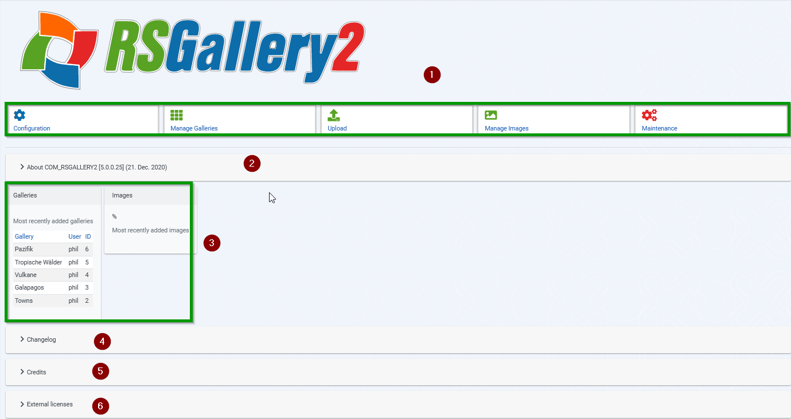
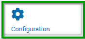
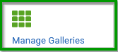
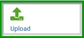
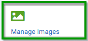
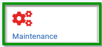
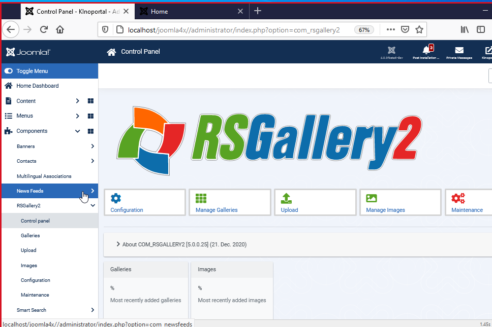

# Control Panel RSGallery2

(1) Function buttons

A click in the gray area will lead to the named section. More see below

(2) RSGallery2 overview tells about the installed version and interesting RSGallery2 links

(3) Last galleries and images overview area **displays a limited list** of the latest galleries and also of the latest images

(4) Credits

A click on credits opens an area where all the **contributors** to RSGallery2 are mentioned. More below

## Functions buttons

(1) **Configuration**

General administrations settings

Enables the configuration of Image settings, Display settings and MyGallery settings

(2) **Manage Galleries** View gallery list, create new galleries, edit gallery, publish ...

(3) **Upload** Opens view for upload with "Drag and drop", upload "from Zip" or Upload "from server folder"

(4) **Manage images** View images list , create new images, edit image, publish ...

(5) **Maintenance** For maintenance exist a "Repair Zone" where content can be checked for consistency, a "Danger zone" to remove the component and a Raw database zone" to see more content of gallery and images list.

(6) **External licenses**

Used external components

## credits

Area where all the contributors to RSGallery2 are listed. See parts in image below.

## Path to Control Panel

to do bild und nummern einfügen

Use toggle menu choose points

- components
- RSGallery2
- controlpanel
