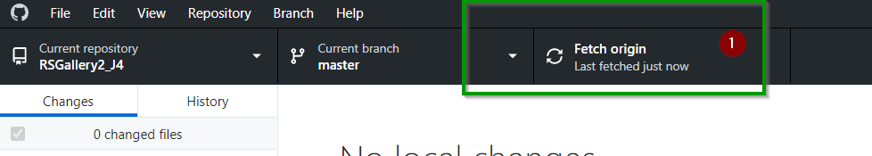
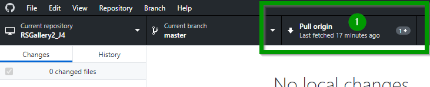
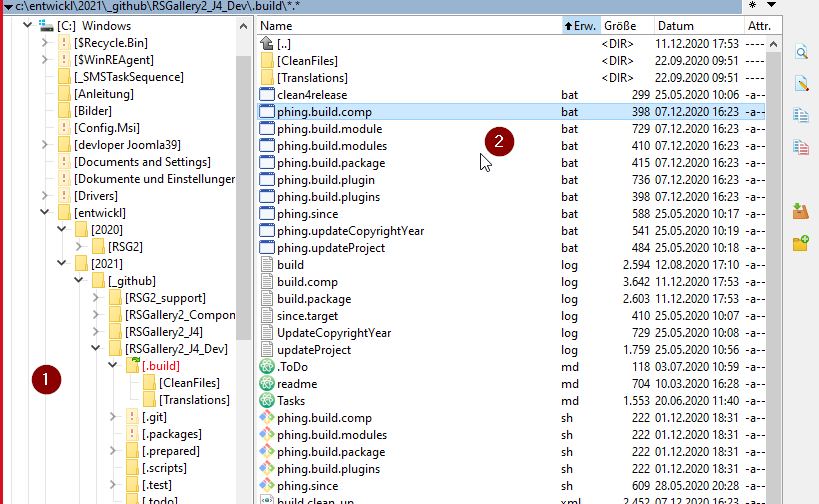
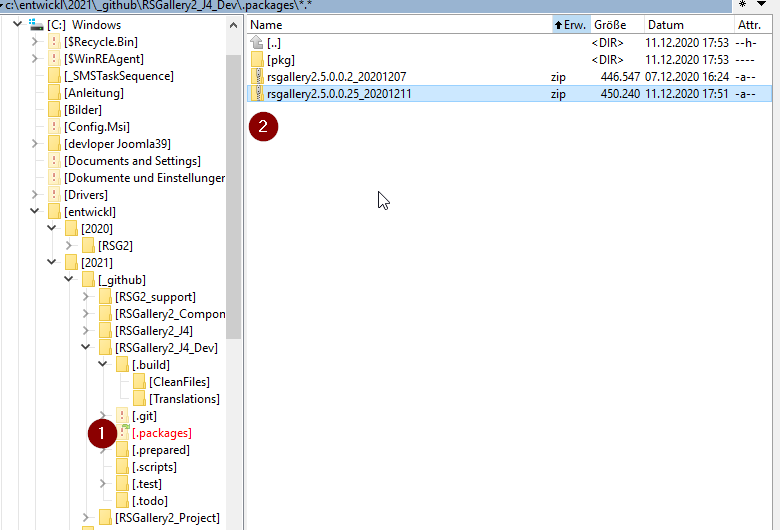

# Build RSG2 J!4x on local computer

Clone this repository and the "sister" repository RSGallery2_J4_Dev to a folder side by side

## check out repositories

clone  following repositories
https://github.com/RSGallery2/RSGallery2_J4
https://github.com/RSGallery2/RSGallery2_J4_Dev

The folders RSGallery2_J4 and RSGallery2_J4_Dev must live in the same folder side by side

## Prepare Phing 

Phing (Simple XML build files) and php must be installed before.

Phing : [Phing web page](https://www.phing.info/)

## Example using github to download the actual updates

### Github fetch

Updates your local repository but does not change the code you are working on

(1) click on fetch origin

### Github pull

Updates your local repository and merge new code with old work

(1) click on pull origin button

## Create installation file (*-zip) with phing

### Start Build

(1) Open the directory RSGallery2_J4_Dev/.build

(2) Call file phing.build.comp.bat or just call phing there

## Build result

(1) Open the directory RSGallery2_J4_Dev/.packages

(2) Here the file rsgallery2.5.0.0.25_20201211 is the resulting installation Zip. The date in the name will change to the actual one.

**Don't close the explorer**

You may later drag and drop the file direct into joomla
