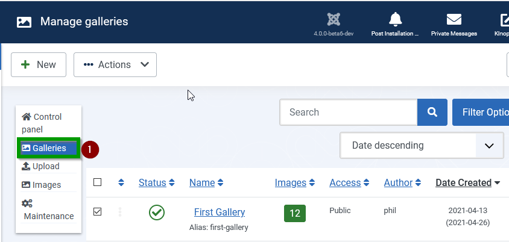
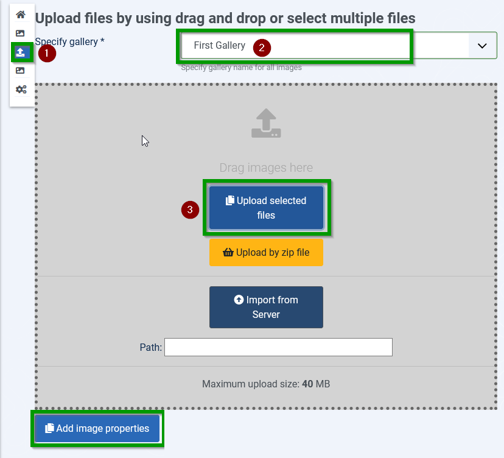
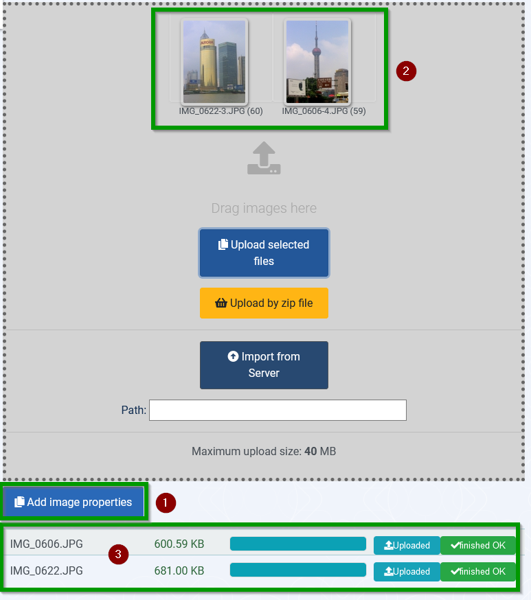
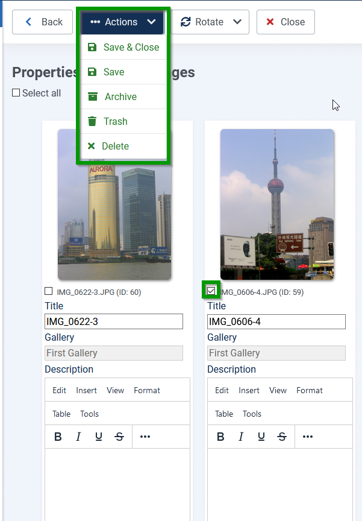

# First steps (2) Upload images

a) Prepare 2 images (example each image < 1MB)

## Select upload from
Select Upload in Control panel in sidebar

sidebar:

## Upload files

1. Select upload  in Control panel in sidebar
2. Select your created gallery
3. Upload selected files. After some times they will appear in the drag and drop area. Then they will appear in the drag and drop area.

Resulting from:

1. If you want to set a title and write a description use button "Add image properties"
2. Uploaded images have appeared
3. For each uploaded image the prozessbar shows the amount of uploaded Bytes.

to do rotate u. tirel unfo ändern
action entfernen
