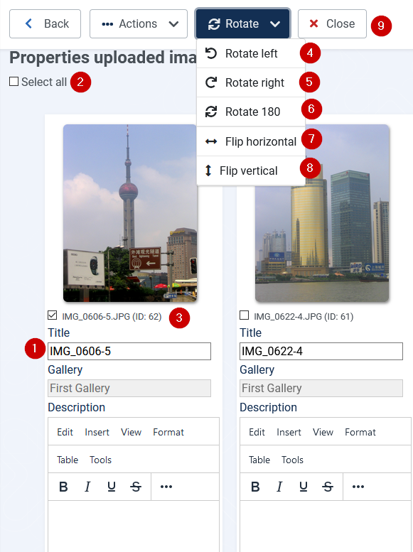

# First steps (2) Upload images

toDo Abschnitt nach upload in first steps verschieben. Bild: upload sollte als  (1)

a) Prepare 2 images (example each image < 1MB)

## Select upload from
Select Upload in Control panel in sidebar

sidebar:

## Upload files

1. Select upload  in Control panel in sidebar
2. Select your created gallery
3. Upload selected files. After some times they will appear in the drag and drop area. Then they will appear in the drag and drop area.

Resulting from:

1. If you want to set a title and write a description use button "Add image properties"
2. Uploaded images have appeared
3. For each uploaded image the prozessbar shows the amount of uploaded Bytes.

(1) Title

The title is preset on creation. It may be edited here. The title may be different to the uploaded image name when the name already existed. Then the next name already existed. The next free number is appended.

(2) Select all

All images will get a set hook in the box below the image. This can be used to delete, rotate or flip selected images.

(3) Select images

The image will get a set hook in the box below the image. This can be used to delete, rotate or flip selected images.

## DropDownButton Rotate

(4) Rotate left

Rotates selected images 90 degrees against the clock.

(5) Rotate right

Rotates selected images 90 degrees with the clock.

(6) Rotate 180 degrees

Rotates selected images 180 degrees.

(7) Flip horizontal

Flips the selected images horizontal. The bits move from left to right.The bottom of images keeps being the bottom.

(8) Flip vertical

Flips the selected images vertical. The bits move from bottom to top.The left/right side of the images keeps being of the left/right side.

(9) Close
