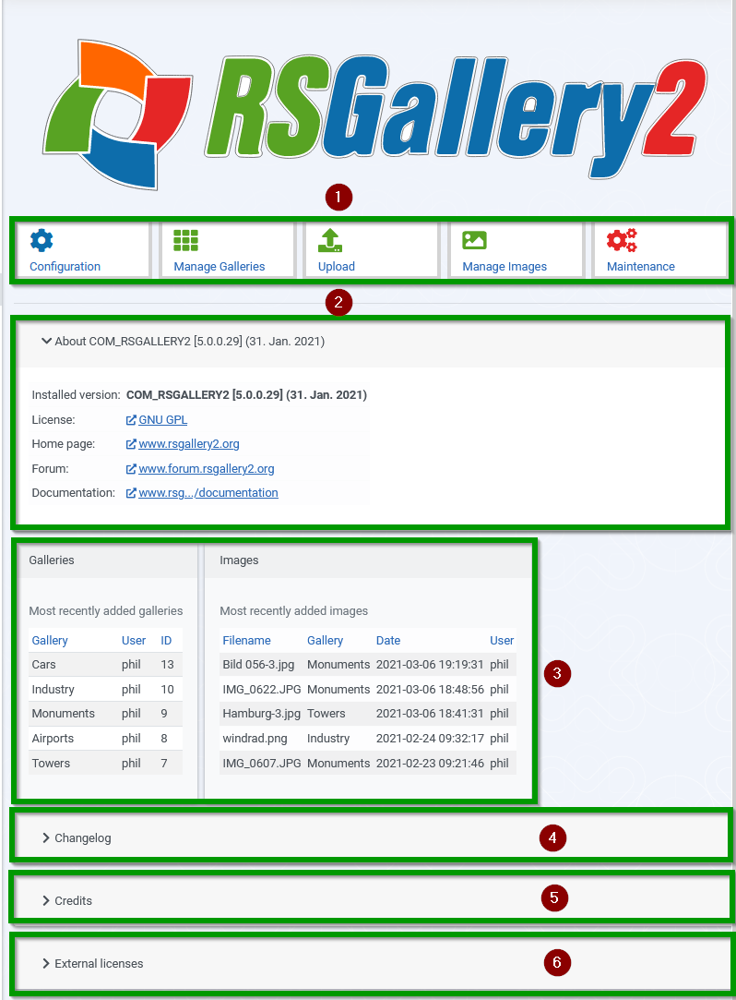
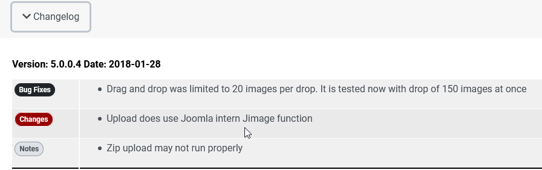
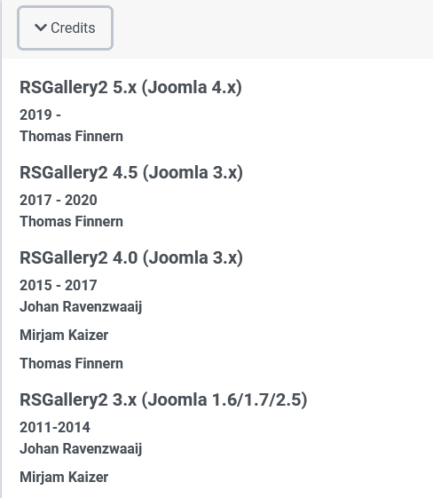
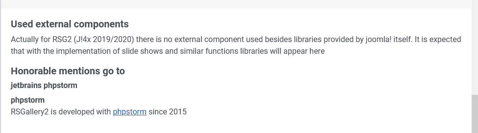

# Control Panel RSGallery2

(1) Function buttons

A click in the gray area will lead to the named section. More see below

(2) RSGallery2 overview tells about the installed version and interesting RSGallery2 links

(3) Last galleries and images overview area **displays a limited list** of the latest galleries and also of the latest images

(4) Changelog

A click on changelog tells about the last fixes and improvements of the RSG2 source code

(5) Credits

A click on credits opens an area where all the **contributors** to RSGallery2 are mentioned. More below

(6) External licenses

A click on external licenses tells about the used external components.

## Function buttons

(1) **Configuration**

General administrations settings. Supports the configuration of upload, images, display and further settings

(2) **Manage Galleries**

View gallery list, create new galleries, edit gallery, publish ...

(3) **Upload** Opens view for upload with "Drag and drop", upload "from Zip" or Upload "from server folder"

(4) **Manage images**

View images list , create new images, edit image, publish ...

(5) **Maintenance**

In maintenance exist a "Repair Zone" where content can be checked for consistency, a "Danger zone" to remove the component and a Raw database zone" to see more content of gallery and images list.

(6) **External licenses**

Used external components

## RSGallery2 info

to Do : aufgeklapptes Bild einfügen 

## changelog

This display above is just an example how it will look in the future (No changes before first release)

[ ] ToDo: Thomas: Description of special elements

- bugs
- improvements

## Credits

Area where all the contributors to RSGallery2 are listed. See parts in image below.

## External licenses

Used external components
