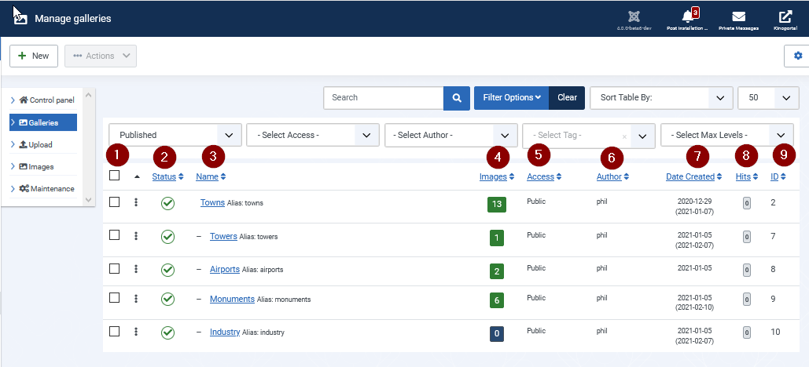
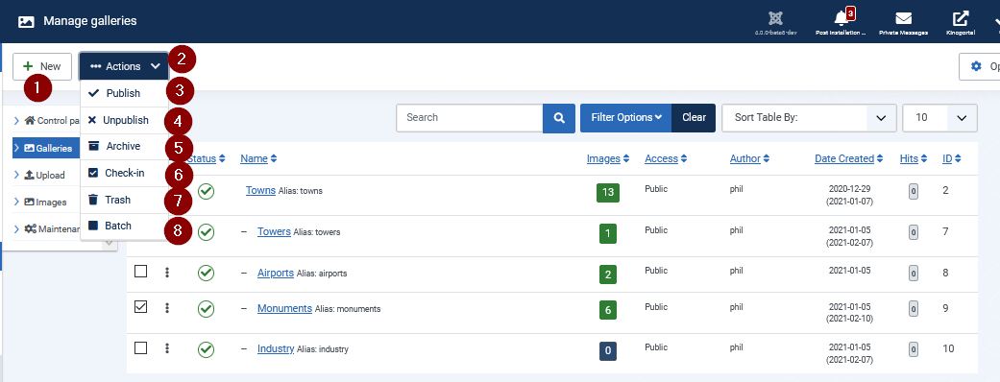
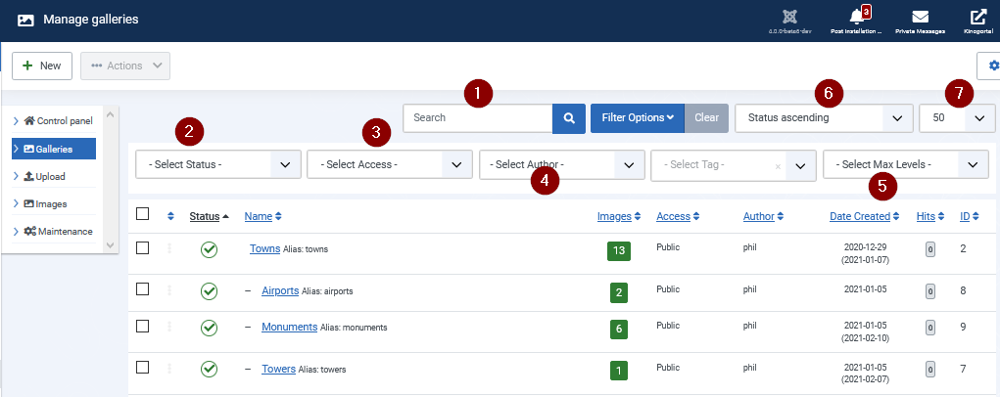
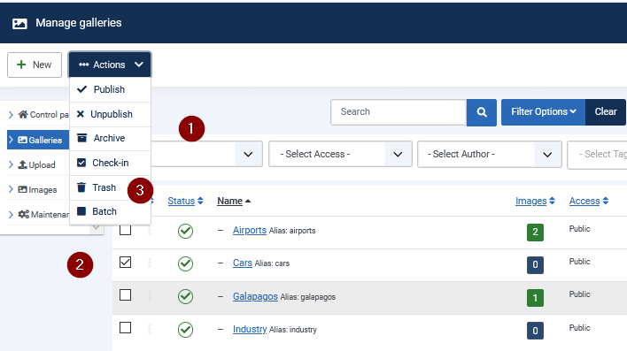
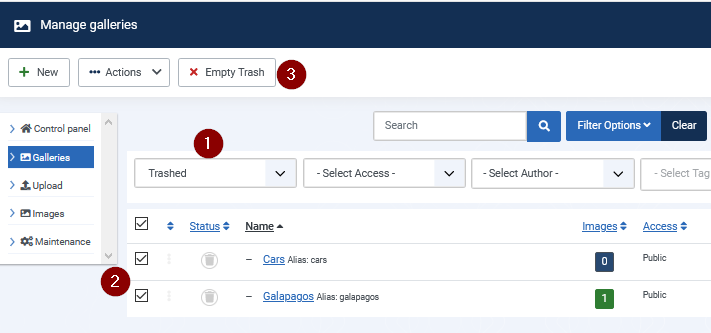
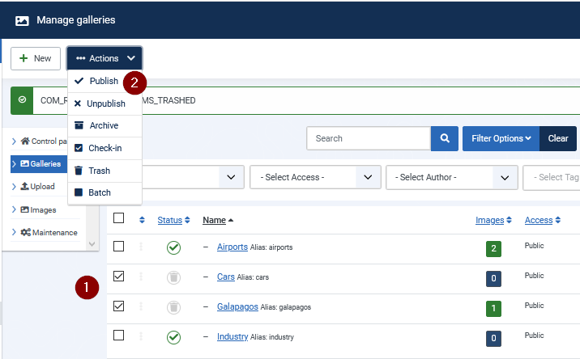

#  List View

## Gallery list columns

[ ] ToDo: thomas: check and compare with J3x version (same folder) and images ...

     

(1) Select Gallery

The topmost rectangle selects all galleries which is useful for batch processing.
The selector beside the gallery information selects this Gallery

(2) Status

A green 'OK' tell the image is published. (Otherwise red)

(3) Gallery name

A click on the name leads to edit view of the selected gallery

(4) Images

Tells the count of images inside the gallery
The  arrow on the right side will list the images count descending  or
ascending

 (5) Access

 %

 (6) Author

 The author logged in when creating the gallery

 (7) Dated created

 Creation Time of gallery

 (8) Hits

 count of views / appearances

 (9) ID

 Internal ID of image for reference or matching in other list

# Gallery (s) task buttons

(1) New

Creates a new gallery. Leads to edit view of the new selected image

(2) Click on the DropDown_Button Actions

Actions on selected galleries

Only galleries of the select status type will be use.

(3) Publish

Assign published to the selected Images

(4) Unpublish

Assign unpublished to the selected Images

(5) Archive

Assign archived to the selected Images

(6) Check in

Remove "Checked out" of the selected images

(7) Trash

Move selected images into trashed items

(8) Batch

Uses the selected images for the tasks in the batch form

Possible batch tasks:

- Move image(s) to gallery
- Copy image(s) to gallery
- Add (change) properties to image(s)
-
See below

# Galleries search options

(1) Search

search for existing Gallery

(2) Select Status

Only galleries of the select status type will be shown.
Types: Trashed, Unpublished, Published, Archived, ALL       

(3) Select access Types

Only galleries of the select Access type will be shown.
Types: Public, Guests, Registered, Special, Super users

(4) Select author

Only galleries of the select author will be shown.

(5) Select Max Levels

Maximum depth of gallery children will be shown

(6) Sort Table By

Date, Author, Name, Status, Images, Access, Hits, ID

(7) Limit per page

It defines the count of galleries which will be shown on one page

# How to delete galleries

  

(1) Select status

All galleries will be shown

(2) Select the appropriate gallery

(3) choose Trash from the ListBox

(1) Select trashed  

(2) choose galleries

(3) click on the button empty Trash

## How to restore trashed Galleries

(1)  Select trashed gallery

(2) choose Publish from the ListBox
