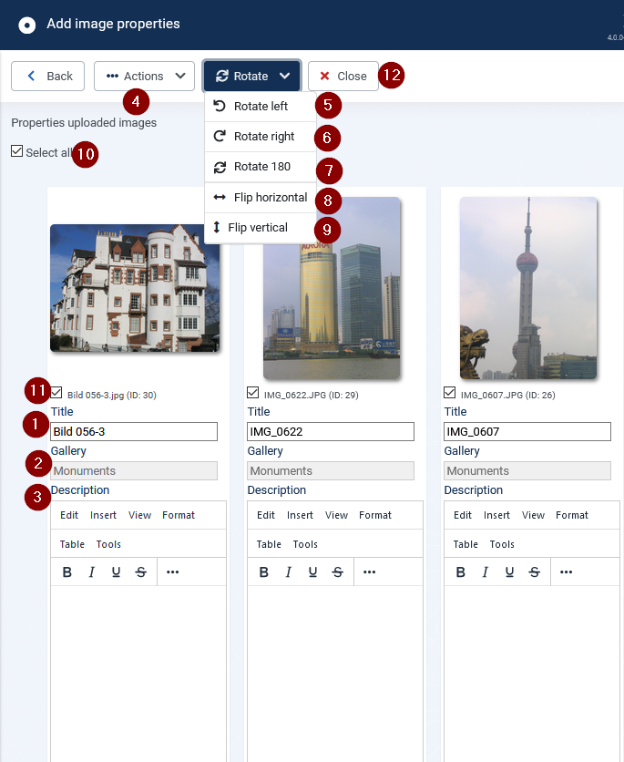

# Add image properties

[ ] ToDo: thomas: check to be used

This form enables to the properties title and description for a batch of images at the same time. It is reached normally over the upload form. It can also be reached with selected images over the batch button in the images list form.

(1) Title

The title is preset on creation. It may be edited here. The title may be different to the uploaded image name when the name already existed. Then the next name already existed. The next free number is appended.

(2) Gallery

The gallery name can't be changed.

(3) Description

The description may be changed with the standard editor like in the edit single image form.

## (4) Actions

**Save and close** Save changes and continue edit on the same images.

**Save** Save changes and continue edit on the same images.

**Archive** Assign archived to the selected Images

**Trash** Move selected images into trashed items

**Delete** All same images can be selected for deleting. Clicking on delete Button will delete the selected images from the RSGallery2 database and the created image files.

## DropDownButton Rotate

(5) Rotate left

Rotates selected images 90 degrees against the clock.

(6) Rotate right

Rotates selected images 90 degrees with the clock.

(7) Rotate 180 degrees

Rotates selected images 180 degrees.

(8) Flip horizontal

Flips the selected images horizontal. The bits move from left to right.The bottom of images keeps being the bottom.

(9) Flip vertical

Flips the selected images vertical. The bits move from bottom to top.The left/right side of the images keeps being of the left/right side.

(10) Select all

All images will get a set hook in the box below the image. This can be used to delete, rotate or flip selected images.

(11) Select images

The image will get a set hook in the box below the image. This can be used to delete, rotate or flip selected images.

(12) Close

Go back to page Manage images.
