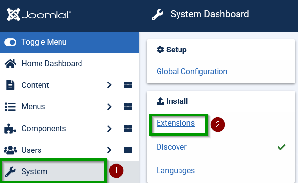
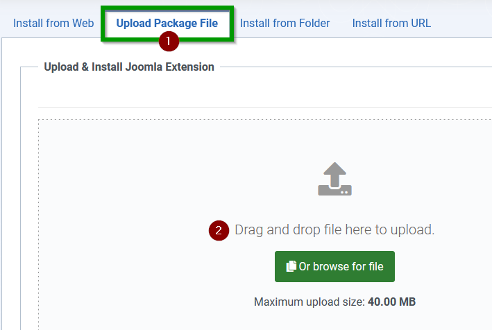
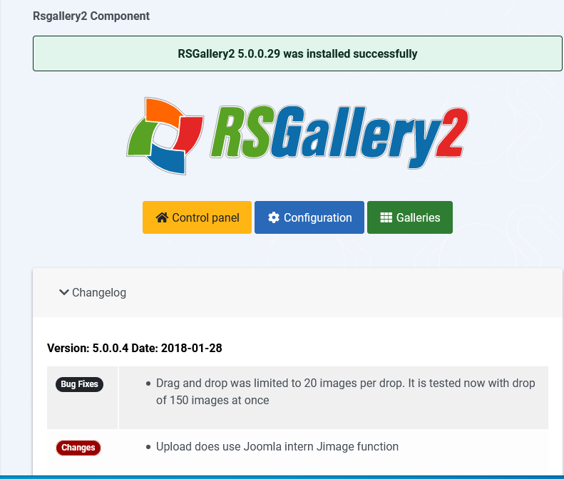

# Installation

## 1. Download the main RSGallery2_component

 On Github look for the latest version (Todo version )  

Inside the assets you will find a zip file with a name like **RSGallery2_component.zip

Download the latest zip file matching this name and a newer version number

(1) Select System

(2) Select Extension

## 2. Install RSGallery2 component

RSGallery2 is installed like all other Joomla extensions. Log into the Administrator section, click on Extension. Select Upload package file.

(1) Select 'Uploaded Package File' tab

(2) Drag and drop the downloaded zip file into  the drop area.

On successful uploaded you will get a messages similar to following image

